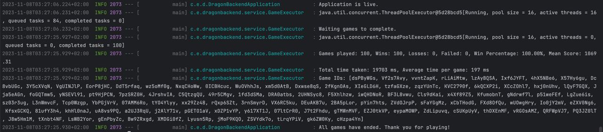
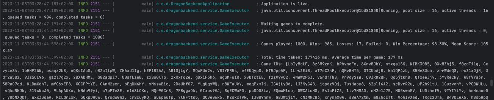

# Dragons of Mugloar (Backend)

## About this project

This project is a program that plays the Dragons of Mugloar game.

## Prerequisites

* [Java 17](https://www.oracle.com/java/technologies/javase/jdk17-archive-downloads.html)

  ```sh
  https://www.oracle.com/java/technologies/javase/jdk17-archive-downloads.html
  ```

* [Maven](https://maven.apache.org/download.cgi)

  ```sh
  https://maven.apache.org/download.cgi
  ```
  
## About the program

### Game flow

The game flow represents the finite-state machine with the states that are
specified inside the GameState enum(START_GAME, GET_TASKS, EVALUATE_TASKS, SOLVE_TASK,
GET_SHOP_ITEMS, BUY_POTION, EVALUATE_SHOP_ITEMS, BUY_SHOP_ITEMS, EVALUATE_END_GAME, END).

Game flow:
1. Start game(START_GAME).
2. Get tasks(GET_TASKS).
3. Evaluate tasks and pick the best task(EVALUATE_TASKS).
4. Solve chosen task(SOLVE_TASK).
5. Get list of shop items(GET_SHOP_ITEMS).
6. Evaluate and pick the best item(EVALUATE_SHOP_ITEMS).
7. Buy item from the shop(BUY_SHOP_ITEMS).
8. Repeat starting from 2.
9. When end game is reached evaluate whether the game was a win(more than 1000 points),
a loss(less than 1000 points and 0 lives) or 
a failed game(server not responding to requests and less than 1000 points)(EVALUATE_END_GAME).
10. End the game(END).

Additional states:
- Buy potion when lives are low(BUY_POTION). This state is accessed only from the BUY_SHOP_ITEMS state.

This is the gist, but there are some additional conditions, for example: if there were more than N requests to
the server and there was no successful response, the game is failed(in the GET_TASKS).

### Game strategy

The game strategy here consists of:
1. Taking the easiest, yet profitable tasks.
2. Prefer good deeds(help, rescue etc.) to bad deeds(steal).
3. Buy the unique items when there is enough gold.
4. Buy potions when lives are low(1).
5. Save money for one health potion when lives are less or equal to 2.

When the strategy was to buy health potion after any task failure and saving the money for
the health potion at all times(including starting 3 health) the win rate was around 75%.
The additional condition for buying the health potion only when lives are low(1)
and keeping the money when the lives are less or equal to 2 made the win rate around 97%.

### Game results

The asynchronous and parallel execution of the games was implemented to easily track the results of the many games.
The games could be won(by having more than 1000 points), lost(by having less than 1000 points and 0 lives)
or failed(server not responding to request with retries and less than 1000 points).

By running 100 and 1000 games at the same time the results are positive: more than 90% wins(on both images 99%)!






### Mistakes in the api description

There were some mistakes in the api description.

#### Types

1. reward in Message GET is not a ```String```, it is ```number```.


2. shoppingSuccess in Shop POST is not a ```String```, it is ```boolean```.


#### Missing fields
1. probability in the Message GET, that is a ```String```.
2. encrypted in the Message GET, that is a ```Integer``` in Java terms and ```number | null``` in JavaScript terms.

See images in Types -> reward.

## Build

### Build and run using Maven

1. Download .zip or clone project from GitHub.

2. Unzip and/or go to project location in __terminal__.

3. Build the project using maven
   ```sh
   mvn clean package
   ```

4. Run the program
   ```sh
   java -jar ./target/dragon-backend-1.0-SNAPSHOT.jar
   ```
   
### Additional variables

To get more information about the program decisions add ```--verbose``` flag.

```sh
java -jar ./target/dragon-backend-1.0-SNAPSHOT.jar --verbose
```
   
To run multiple games at the same time use the number as variable, for example ```10```.

```sh
java -jar ./target/dragon-backend-1.0-SNAPSHOT.jar 10
```

## Tests

1. GameFSMTest
    
    Integration test where the already played game is playing again as a test.
    The json with the content of all requests and responses is inside the ```testData``` directory.

2. GameServiceTest

    Unit test that is testing the request to the Dragon of Mugloar API v2.

### Coverage

In the images: Class coverage / Method coverage / Line coverage

1. GameFSMTest


2. GameServiceTest


